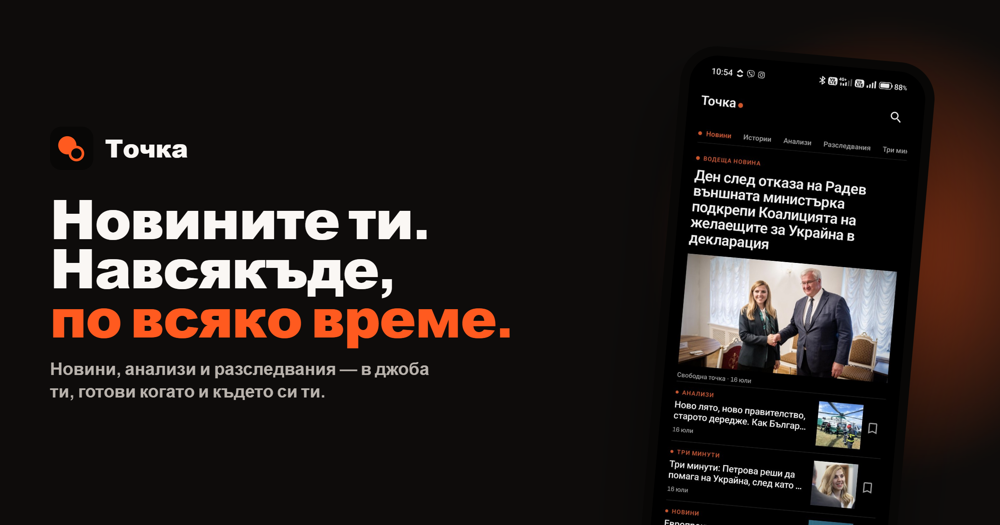
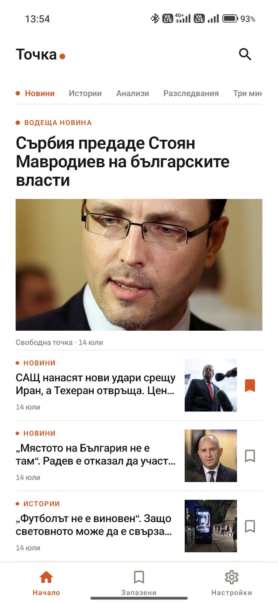
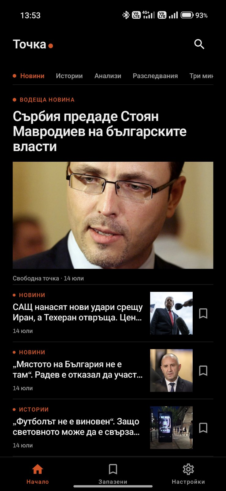
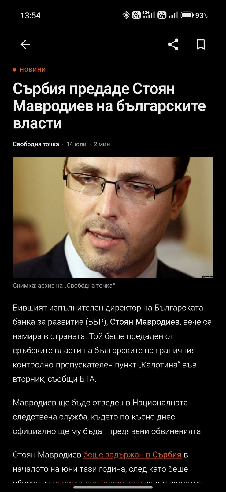
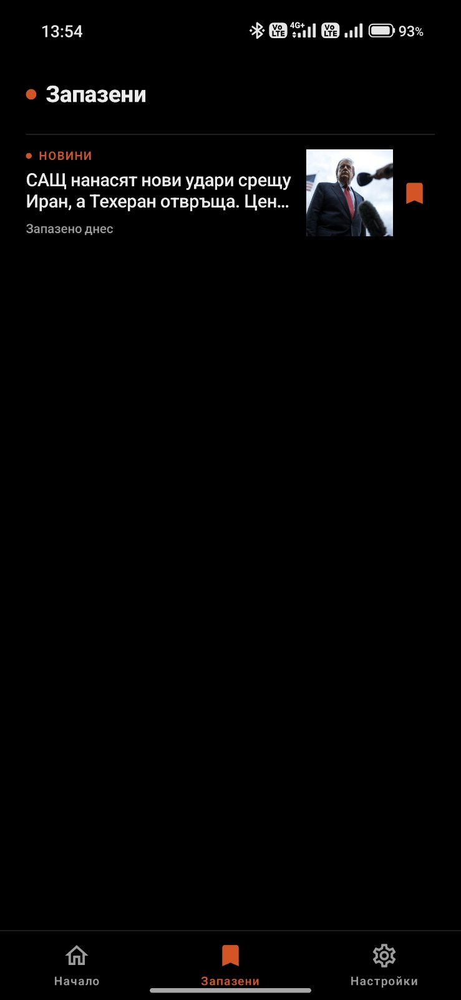
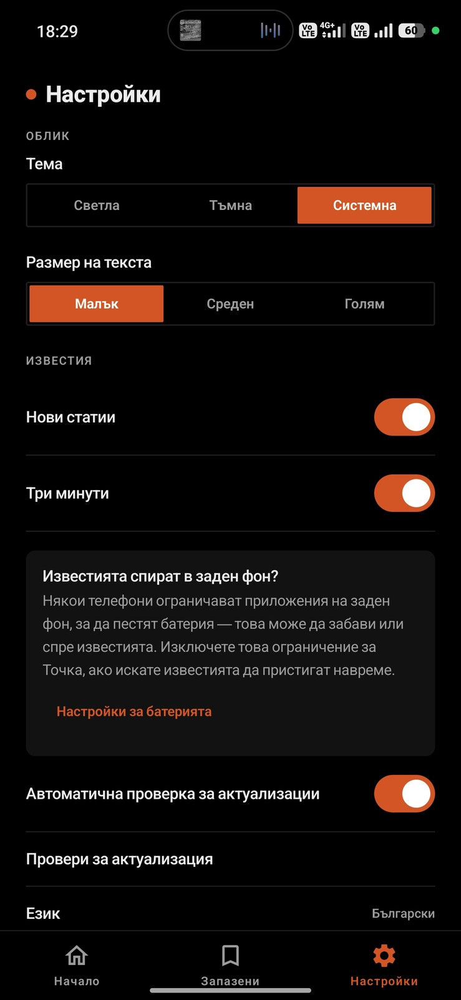

# Точка

Неофициално, независимо Android приложение за четене на [Свободна точка](https://svobodnatochka.bg/) — българско издание, продължаващо работата на бившата българска служба на Радио Свободна Европа.

Това е хоби проект, създаден за по-лесно ползване на мобилната версия на сайта, с оптимизирани функции и подобрения, за всеки един момент.

**Това приложение не е направено, одобрено или поддържано от Свободна точка.** То е доброволен проект, който показва тяхното публично, безплатно съдържание в по-удобен за телефон вид: начален екран, разглеждане по рубрики, четец на статии в приложението, запазени статии с офлайн достъп и светла/тъмна тема. Няма вход, няма платена стена, няма никакъв акаунт — всичко, което приложението показва, вече е публично на техния сайт.

Ако искате да подкрепите истинската им работа, посетете направо [svobodnatochka.bg](https://svobodnatochka.bg/).

## Снимки на екрана

<table>
  <tr>
    <td><br><sub>Начало (светла)</sub></td>
    <td><br><sub>Начало (тъмна)</sub></td>
    <td><br><sub>Статия</sub></td>
  </tr>
  <tr>
    <td><br><sub>Запазени</sub></td>
    <td><br><sub>Настройки</sub></td>
    <td></td>
  </tr>
</table>

## Какво прави

- **Начало** — хоризонтални рубрики. Първият таб ("Новини") е смесен поток от всички рубрики с водеща новина отгоре; останалите табове (Истории, Анализи, Разследвания, Три минути, Видео) показват съответната си рубрика.
- **Статия** — пълното съдържание на статията, рендирано от собствения HTML на сайта в ограничен WebView, така че вградените връзки, снимки и embed-ове работят нормално, с native горно меню (назад / споделяне / запази).
- **Запазени** — запазвайте статии за офлайн четене; при запазване целият HTML на статията се кешира локално, така че запазените статии работят и без връзка.
- **Настройки** — тема Светла / Тъмна (истинско AMOLED черно) / Системна, множител за размер на текста (Малък / Среден / Голям), приложен навсякъде в приложението, и двата превключвателя за известия по-долу.
- **Търсене** — просто търсене по ключова дума през собствения search endpoint на сайта.
- **Известия** — фонова задача проверява сайта периодично и показва локално известие само със заглавието на новата статия. Два отделни превключвателя: общи нови статии (без "Три минути") и отделен превключвател за "Три минути", всеки на собствен notification channel. Няма акаунт, сървър или push услуга от какъвто и да е вид — това е клиентска проверка срещу същия публичен REST API.
- **Актуализации** — приложението проверява [GitHub Releases](https://github.com/9emilg/tochka/releases) за нова версия (най-много веднъж на 24 часа), с ненатрапващо известие на началния екран и бутон за ръчна проверка в Настройки. Отделен превключвател спира автоматичната проверка изцяло.

## Източник на данни

Всичко идва directно от публичния WordPress REST API на Свободна точка — няма mock данни и няма отделен backend:

- `GET /wp-json/wp/v2/posts?_embed&per_page=20&page={n}&categories={id}` — списък със статии, с водеща снимка и имена на рубрики, извлечени през `_embedded`.
- `GET /wp-json/wp/v2/posts/{id}?_embed` — единична статия (използва се от екрана за статия и за deep-linking към конкретна публикация).
- `GET /wp-json/wp/v2/posts?_embed&search={query}` — търсене.
- `GET /wp-json/wp/v2/categories?per_page=50` — списък с рубрики, използва се за да се свържат табовете по-горе с реалните им WordPress category ID.

## Технологии

- Kotlin, Jetpack Compose, Material 3
- Navigation Compose
- Retrofit + kotlinx.serialization за WordPress REST API-то
- Room за кеша на запазените статии
- Jetpack DataStore (Preferences) за настройките
- WorkManager за периодичната проверка за нови статии, Hilt за dependency injection навсякъде
- Coil за зареждане на изображения
- Min SDK 26, target/compile SDK 34

## Компилиране

Изисквания: JDK 17+ (разработено с JDK 21) и Android SDK (compileSdk 34, build-tools 34.0.0).

Копирайте `local.properties.template` в `local.properties` и попълнете `sdk.dir` (и, ако компилирате release build, стойностите за подписване по-долу) преди компилиране.

### Debug build

За локално тестване и разработка:

```bash
# Windows
gradlew.bat assembleDebug

# macOS/Linux
./gradlew assembleDebug
```

Debug APK-то се записва в `app/build/outputs/apk/debug/app-debug.apk`.

### Release build

Приложението вече използва подписан release build — версиите, публикувани в [Releases](https://github.com/9emilg/tochka/releases), са подписани с частен keystore, който не е част от репото.

За да компилирате release build локално, ви трябва собствен keystore — release build-ът очаква следните стойности в `local.properties`:

```
RELEASE_STORE_FILE=path/to/your.keystore
RELEASE_STORE_PASSWORD=...
RELEASE_KEY_ALIAS=...
RELEASE_KEY_PASSWORD=...
```

Генерирайте собствен keystore за локално компилиране (APK-та, компилирани локално с ваш собствен keystore, ще имат различен подпис и Android няма да ги разпознае като актуализации на официално публикуваните версии):

```bash
keytool -genkey -v -keystore release.keystore -alias tochka -keyalg RSA -keysize 2048 -validity 10000
```

После:

```bash
# Windows
gradlew.bat assembleRelease

# macOS/Linux
./gradlew assembleRelease
```

Release APK-то се записва в `app/build/outputs/apk/release/app-release.apk`. Ако стойностите за подписване липсват в `local.properties`, компилацията просто ще произведе неподписан release build, вместо да гръмне.

## Лиценз

MIT — вижте [LICENSE](https://github.com/9emilg/tochka/blob/main/LICENSE). Собственото съдържание на Свободна точка си остава тяхна собственост; това приложение само го показва, не го прелицензира.
